# Dental Appointment Scheduling System 🦷

A full-stack web application that allows patients to register, log in, schedule dental appointments, and view appointment details. Built using React, Node.js, Express, MySQL, and JWT for authentication.

## 🌐 Live Demo

Coming soon...

## Deployed URL
 - Frontend: https://dt47nb2edopot.cloudfront.net/
 - Backend API: https://api.rent-hive.co/

## 🚀 Features

- User registration and login with JWT authentication
- Secure password hashing with bcrypt
- Schedule new appointments
- View existing appointments
- Admin panel (optional)
- CORS and cookie-based authentication support
- Hosted on AWS (EC2, S3, CloudFront, RDS)

## 🧰 Tech Stack

**Frontend:**
- React
- Vite
- Axios
- Tailwind CSS

**Backend:**
- Node.js
- Express
- MySQL
- JWT (JSON Web Tokens)
- bcrypt

**Deployment:**
- AWS EC2 (backend)
- AWS S3 + CloudFront (frontend)
- Cloudflare (DNS & SSL)

## 📦 Installation

## Prerequisites

- Node.js and npm
- MySQL

### Frontend Setup
```bash
git clone https://github.com/clydeortega14/dental-office-online-scheduling-system-frontend.git
cd dental-office-online-scheduling-system-frontend
```

#### Create a .env file
```bash

VITE_API_URL=
VITE_APP_NAME=
```
#### install npm and run dev
```bash
npm install && npm run dev
```

#### Production build
```bash
production
npm run build
```

### Backend Setup


```bash
git clone https://github.com/clydeortega14/dental-backend.git
cd dental-backend
npm install
```

Create a .env file

```bash
#Database Connection
DB_HOST=
DB_USER=
DB_PASSWORD=
DB_NAME=
DB_PORT=
PORT=

#JWT
JWT_SECRET=

# CORS ORIGIN
ALLOWED_ORIGIN=

```

#### serve the app
```bash
nodemon server.js OR node server.js
```
## 📸 Screenshots
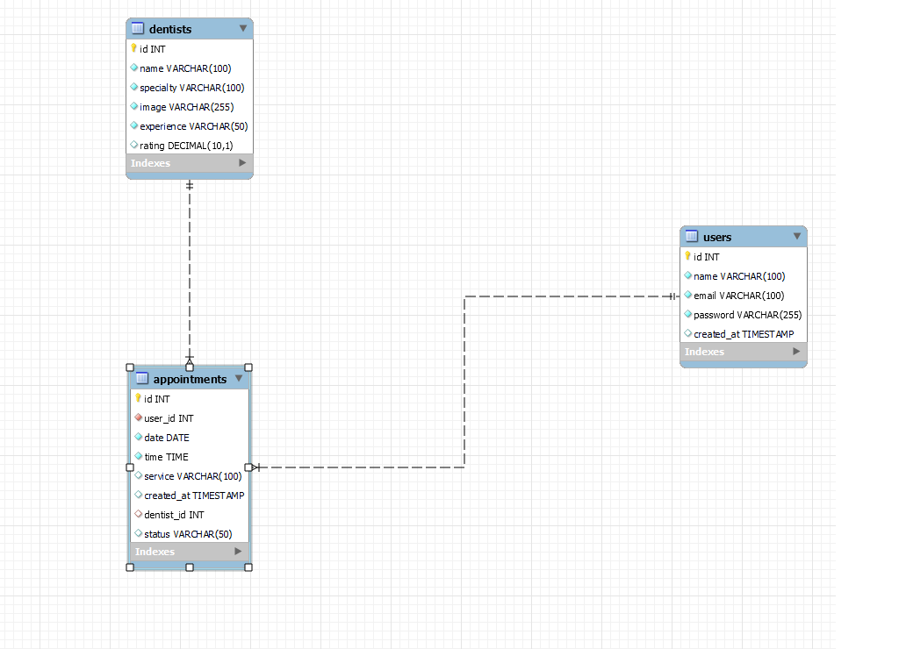.
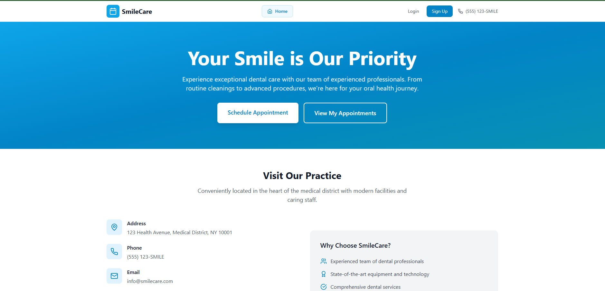
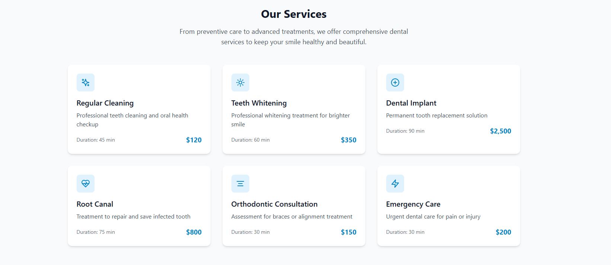
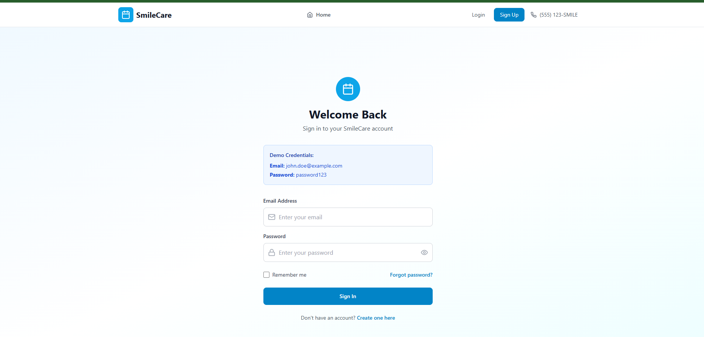.
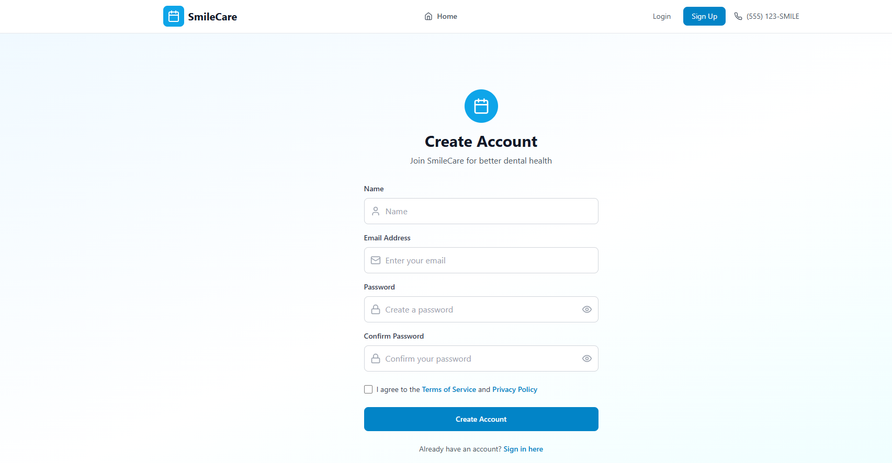
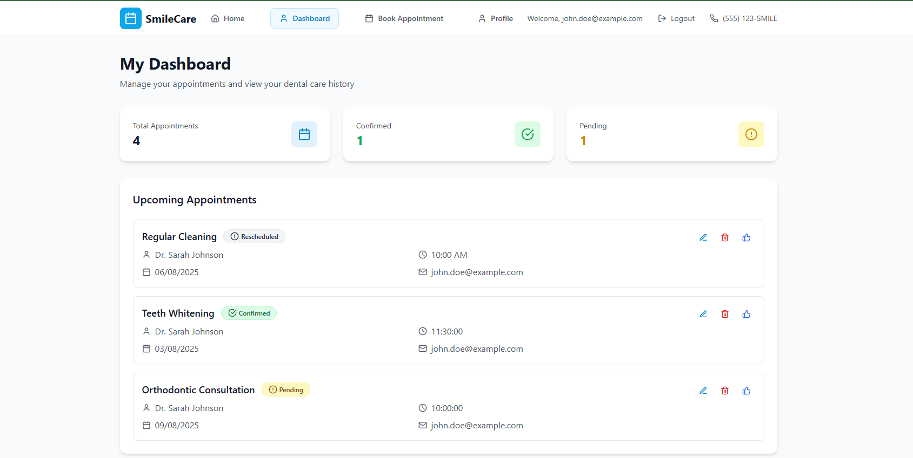.
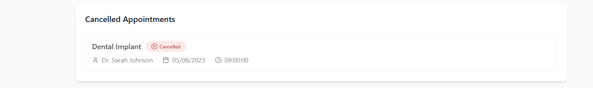.
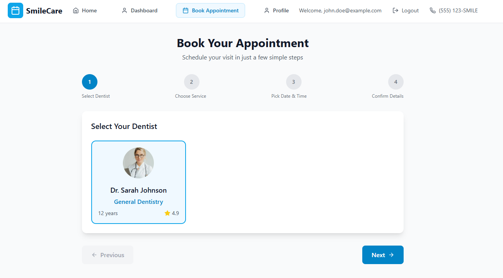.
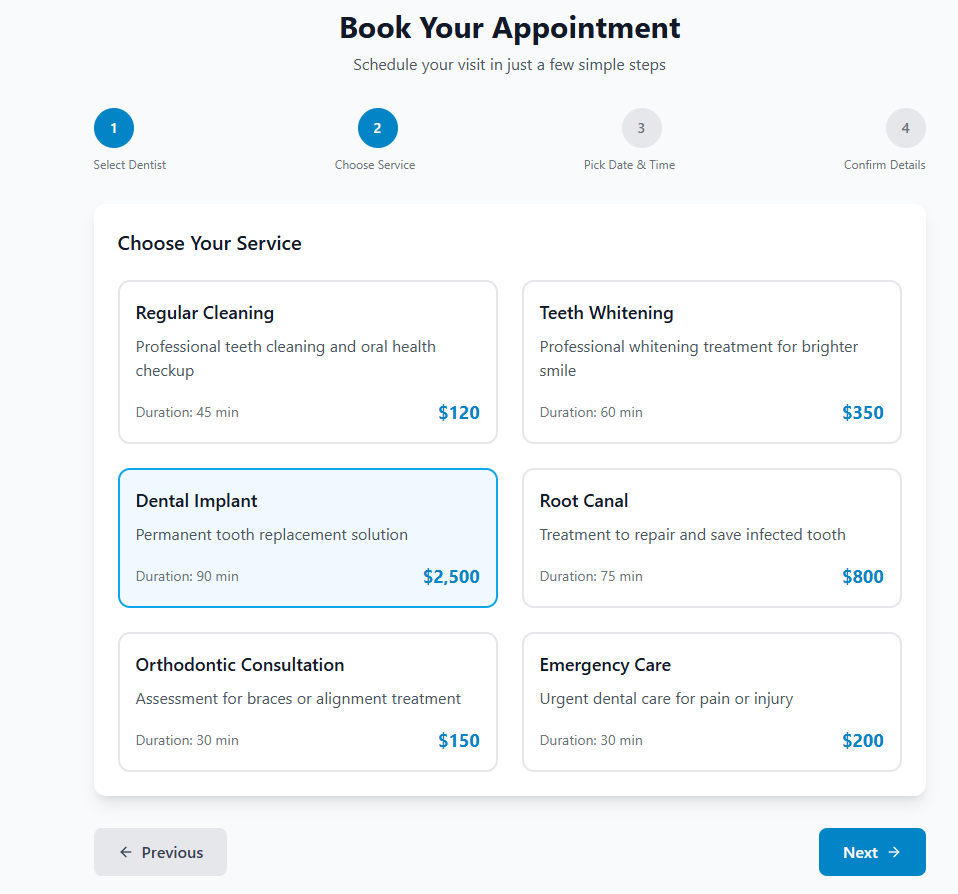.
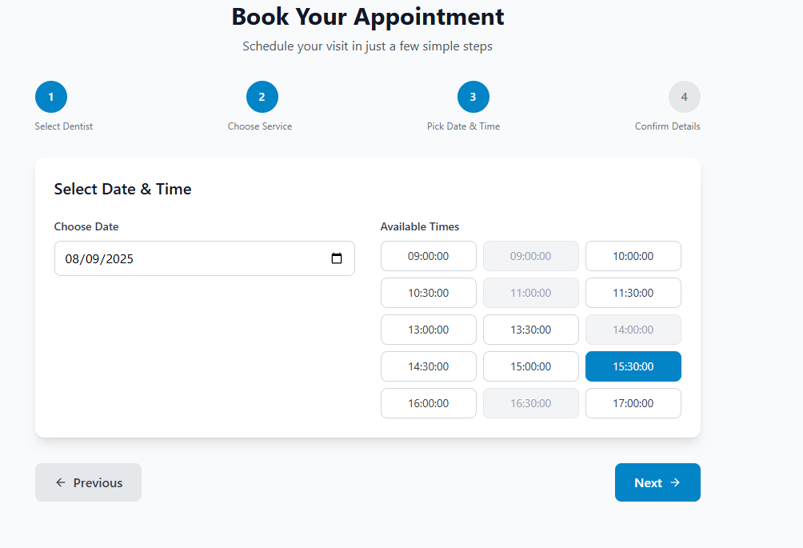.
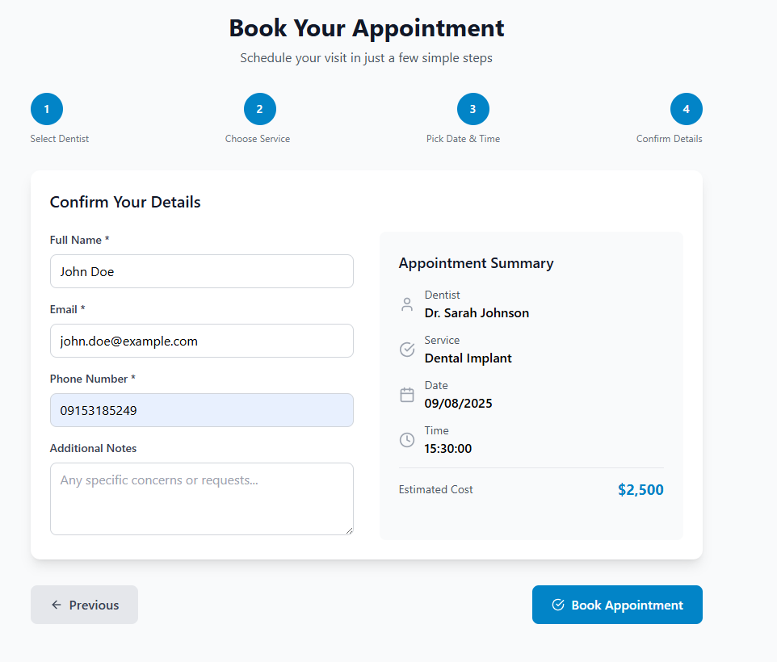.
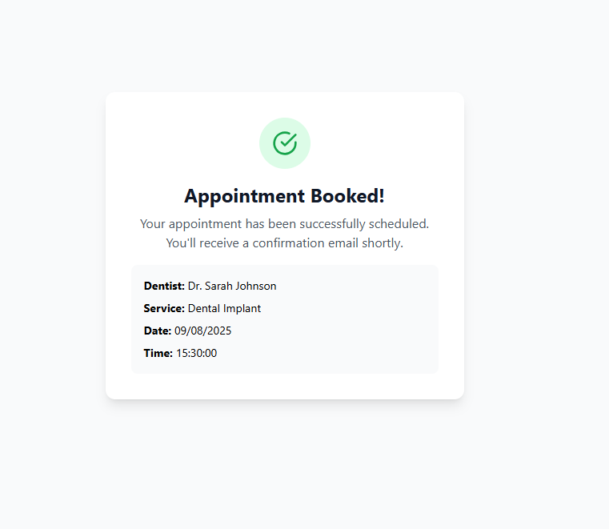.
